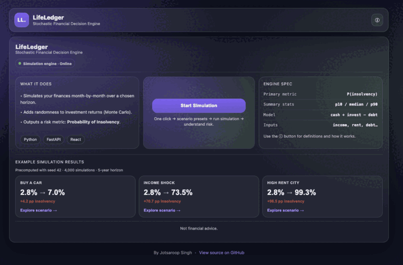
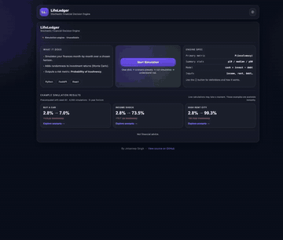
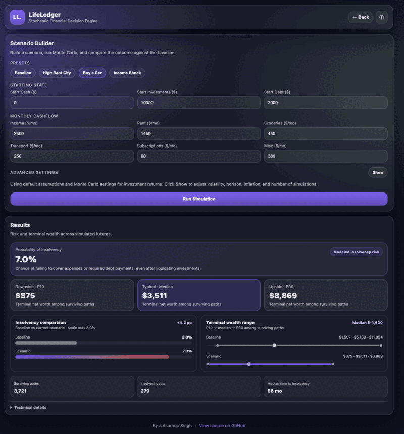

# LifeLedger

**A stochastic financial decision engine that simulates thousands of possible financial futures and measures how decisions change insolvency risk.**

[**Launch Live Demo →**](https://lifeledger-1.onrender.com/)

> The deployed backend runs on Render and may take a moment to wake from an idle state. Precomputed example results are available immediately while it starts.



## Why I Built It

Traditional budgeting calculators usually assume one deterministic future. LifeLedger was built around a more useful question:

**How does a financial decision change risk when future investment returns are uncertain?**

Instead of returning one projected balance, LifeLedger simulates thousands of possible futures and compares decisions using **probability of insolvency** and **terminal wealth distributions**.

## Demo



The demo compares the **Buy a Car** scenario against the same baseline financial profile.

## What It Does

LifeLedger models a user's finances month-by-month across a configurable time horizon. Each simulated path tracks cash, investments, debt, income, and recurring expenses while accounting for:

- stochastic investment returns
- income growth and expense inflation
- debt interest and required payments
- automatic investment liquidation when cash is insufficient
- early termination when a path becomes insolvent

For every scenario, the engine reports:

- **Probability of Insolvency**
- **P10 / Median / P90 terminal net worth** among surviving paths
- surviving and insolvent path counts
- median time to insolvency

## Example Results

The landing page includes fixed-seed examples using **4,000 simulations**, a **5-year horizon**, and **seed 42**.

| Scenario | Baseline Risk | Scenario Risk | Change |
| --- | ---: | ---: | ---: |
| Buy a Car | 2.8% | 7.0% | +4.2 pp |
| Income Shock | 2.8% | 73.5% | +70.7 pp |
| High Rent City | 2.8% | 99.3% | +96.5 pp |

### Buy a Car Example



For this preset:

- insolvency risk rises from **2.8% to 7.0%**
- **279 of 4,000** paths become insolvent
- **3,721 paths** survive the full horizon
- median time to insolvency is **56 months**
- survivor median terminal net worth falls from **$5,130 to $3,511**

## Paired Scenario Comparison

LifeLedger runs the baseline and selected scenario with the same simulation settings and random seed.

For seeded simulations, each Monte Carlo path receives its own reproducible random stream from `(seed, path_index)`. Corresponding baseline and scenario paths therefore experience the **same sequence of market shocks**.

```text
Baseline path 1 ─┐
                 ├─ same market shocks
Scenario path 1 ─┘

Baseline path 2 ─┐
                 ├─ same market shocks
Scenario path 2 ─┘
```

This paired setup makes the comparison more meaningful: differences in outcomes come from the financial scenario rather than unrelated random draws.

## How the Simulation Works

Each path advances one month at a time. During every month, the engine:

1. adds income and subtracts recurring expenses
2. liquidates investments if cash cannot cover expenses
3. marks the path insolvent if expenses still cannot be covered
4. accrues debt interest and calculates the required payment
5. liquidates investments if needed to make that payment
6. marks the path insolvent if the payment still cannot be made
7. pays debt and invests a configurable portion of remaining cash
8. applies a stochastic monthly investment return
9. grows income and expenses using the configured annual assumptions

Only paths that survive the full horizon contribute to the P10, median, and P90 terminal net worth statistics.

### Reproducible Monte Carlo Paths

Annual return assumptions are converted to monthly rates, while annual volatility is scaled by `sqrt(12)`. When a seed is supplied, NumPy initializes each path independently from:

```text
(seed, path_index)
```

This keeps a path's market shocks stable even when another path becomes insolvent early and stops running. Monthly sampled investment losses are capped at **-100%**.

## Architecture

```text
                    React Frontend
                          │
                          │ POST /simulate
                          ▼
                     FastAPI API
                          │
                          ▼
              Monte Carlo Simulation Engine
                          │
              ┌───────────┴───────────┐
              │                       │
       Baseline Scenario       Current Scenario
              │                       │
              └───────────┬───────────┘
                          │
                          ▼
              Risk + Wealth Comparison
```

The React frontend handles scenario construction, presets, backend status, and result visualization. FastAPI validates requests and runs the NumPy simulation engine.

## Tech Stack

**Frontend:** React, Vite, JavaScript, CSS  
**Backend:** Python, FastAPI, NumPy, Pydantic  
**Deployment:** Render

## API

The backend exposes three endpoints:

- `GET /health` — backend availability check used by the frontend
- `GET /schema` — example request generated from the Pydantic models
- `POST /simulate` — runs the Monte Carlo simulation and returns risk and survivor wealth statistics

Example simulation response:

```json
{
  "probability_of_insolvency": 0.07,
  "final_net_worth_p10": 875.0,
  "final_net_worth_median": 3511.0,
  "final_net_worth_p90": 8869.0,
  "insolvent_paths": 279,
  "surviving_paths": 3721,
  "median_time_to_insolvency_months": 56.0
}
```

---

Built by [Jotsaroop Singh](https://github.com/JotsaroopSinghh) · [Portfolio](https://jotsaroopsinghh.github.io/portfolio)
